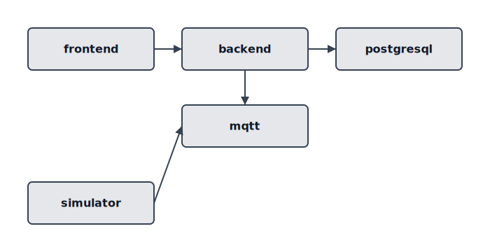
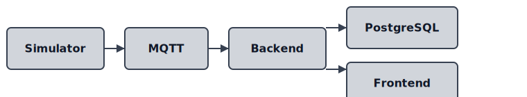

# BrewPi Control v0.0.1 Industrial — Sierra Dorada Automation Suite 4.0 (Docker + PLC Edition)

## Descripción
Sistema SCADA industrial modular y distribuido para control integral de plantas cerveceras industriales, basado en microservicios Docker y arquitectura descentralizada.

## Componentes
- Backend FastAPI (control central, API, lógica de negocio)
- Frontend SCADA HMI (canvas 2D interactivo)
- Broker MQTT Mosquitto (comunicación industrial)
- Base de datos PostgreSQL (registro y trazabilidad)
- Simulador de planta virtual
- PLCs ESP32-S3 (controladores autónomos por zona)

## Objetivos
- Automatización y control de procesos cerveceros
- Modularidad y escalabilidad
- Operación en LAN local aislada (sin internet)
- Portabilidad PC local ↔ Raspberry Pi 5

## Puesta en marcha rápida en Raspberry Pi 5

```bash
# Clonar repositorio
git clone https://github.com/tuusuario/BrewPiControl.git
cd BrewPiControl

# Ejecutar instalador
chmod +x scripts/setup_pi.sh
./scripts/setup_pi.sh
```

El script hará:
1. Copiar `backend/.env.example` → `backend/.env` si no existe.
2. Construir y levantar los contenedores con Docker Compose.
3. Crear automáticamente las tablas (`app.db.create_tables`).
4. Importar `docs/samples/inventory_sample.csv` si la tabla está vacía.

Luego accede a:
* Backend Swagger: `http://<IP-Pi>:8000/docs`
* Frontend SPA: `http://<IP-Pi>:8080`

---

## Diagramas

Los siguientes diagramas SVG ilustran la arquitectura y el flujo de datos del sistema:

| Descripción | Diagrama |
|-------------|----------|
| Topología de contenedores Docker |  |
| Flujo de datos de proceso |  |

## Instalación Rápida
```bash
# Requisitos: Docker y Docker Compose instalados
git clone <REPO_URL>
cd BrewPiControl
docker-compose up -d
```

## Desarrollo y despliegue local

### Requisitos previos
- Docker y Docker Compose instalados
- Python 3.10+ (solo si quieres ejecutar backend fuera de Docker)
- Node.js 18+ (para desarrollo frontend)

### Levantar todo el stack (backend + base de datos + frontend en producción)
```bash
# Desde la raíz del proyecto
cp backend/.env.example backend/.env  # Solo la primera vez
# Opcional: revisa y ajusta variables en backend/.env (DB, puertos, etc)
docker-compose up --build -d
```
- Accede a la API: http://localhost:8000/docs
- Accede al frontend: http://localhost:8080

### Desarrollo rápido del frontend (Vite + backend real)
```bash
cd frontend/webapp
npm install
npm run dev
```
- El frontend estará en http://localhost:5173 y usará el backend real si el proxy está configurado (ver vite.config.js).

### Desarrollo rápido del backend (FastAPI fuera de Docker)
```bash
cd backend
python -m venv .venv
.venv/Scripts/activate  # Windows
pip install -r requirements.txt
uvicorn app.main:app --reload --host 0.0.0.0 --port 8000
```

## Importar inventario desde CSV
- Puedes cargar el archivo `docs/samples/inventory_sample.csv` desde el frontend (botón importar) o vía API `/api/inventory/import`.
- El CSV debe tener como mínimo las columnas: `lot_number,name,category,quantity_available,unit`
- Si la importación falla, revisa que los nombres de columnas y tipos coincidan con el ejemplo.
- Si hay proveedores en el CSV, deben existir previamente en la base de datos o se ignorarán esos campos.

## Ejemplo de integración Node-RED/MQTT para cervecería
1. **Node-RED** escucha cambios en inventario vía MQTT:
   - Suscribirse a `brewpi/inventory/updates`
   - Cada vez que un item se crea/modifica en FastAPI, puedes publicar un evento MQTT desde el backend (requiere agregar lógica en el servicio).
2. **Ejemplo de flujo Node-RED**:
   - Nodo MQTT IN → Nodo de lógica (ej: alerta si stock bajo) → Notificación (Telegram, dashboard, etc)
3. **Configurar backend para publicar eventos**:
   - Instala `paho-mqtt` en el backend (`pip install paho-mqtt`)
   - Agrega lógica en el servicio de inventario para publicar en el topic adecuado tras cada alta/modificación.

## Troubleshooting importación de inventario
- Si el CSV no importa:
  - Verifica que los encabezados sean correctos y no tengan espacios extra.
  - Los campos numéricos deben ser válidos (usa punto decimal, no coma).
  - Si algún campo es obligatorio y falta, la API lo indicará en el error.
- Si necesitas importar proveedores, usa primero la API `/api/providers` o crea los proveedores manualmente.

## Flujo recomendado de pruebas end-to-end
1. Levanta backend y base de datos con Docker Compose.
2. Corre el frontend con Vite (`npm run dev`).
3. Prueba crear, editar y eliminar items y proveedores desde la UI.
4. Prueba importar el CSV de ejemplo y verifica que los datos aparecen correctamente.
5. (Opcional) Integra Node-RED/MQTT para automatización industrial.

## Documentación completa
Consulta `/docs` para diagramas, ejemplos y detalles adicionales.
